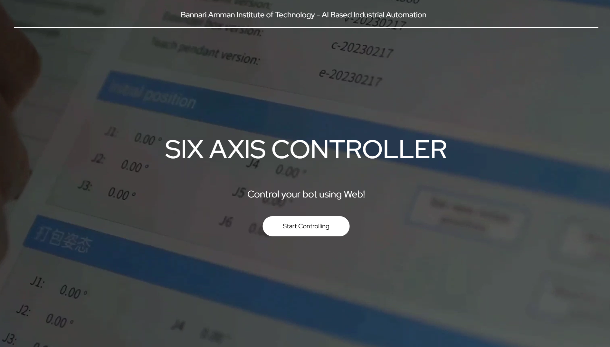
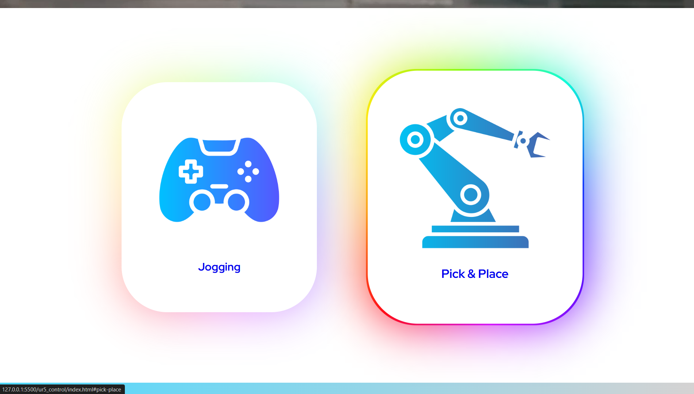
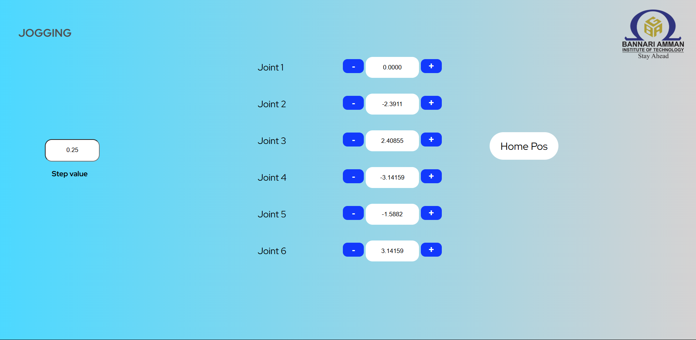
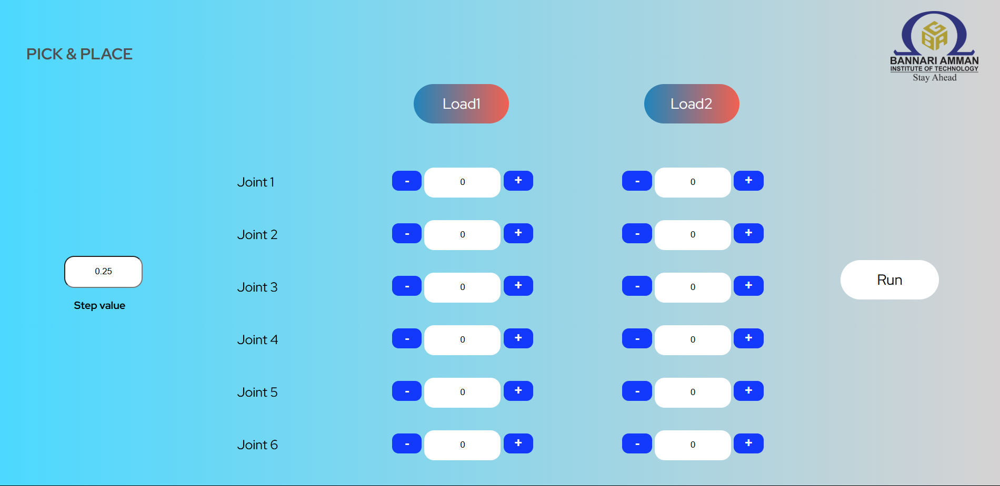

# 🤖 Six-Axis Robotic Arm Web Controller

A **web-based control platform** for a six-axis robotic manipulator that offers both **manual (jogging)** and **automated (pick & place)** modes using **JavaScript frontend** and **Python (ROS 2)** backend. Built to improve human-machine interaction and task precision.

---

## 🚀 Key Highlights

- 🌐 **Real-time robotic arm control** using web interface and ROS 2 (Python)
- 🎮 **Jogging Mode**: Joystick-like manual control with instant feedback  
  → Reduced manual execution time by **30%**
- 📦 **Pick & Place Mode**: Automates object handling using **JSON-based coordinate tracking**
- 🔗 **Client-server communication** ensures high-precision movements with minimal latency

---

## 🛠️ Tech Stack

- **Frontend:** HTML, CSS, JavaScript  
- **Backend:** Python with ROS 2  
- **Communication:** HTTP / REST API (depending on setup)  
- **Control Logic:** JSON-based coordinate mapping

---

## 📸 Interface Screenshots

### 🏠 Home

---

### 🎛️ Control Selection Page

---

### 🕹️ Jogging Page

*Joystick-like controls for intuitive, real-time arm manipulation.*

---

### 🤖 Pick & Place Page

*Automated object handling with programmable coordinates.*

---

## 🎯 What This Project Solves

This platform streamlines **robot control**, eliminates the need for bulky hardware interfaces, and enables **efficient manipulation of robotic arms** in real-world applications like manufacturing, prototyping, and automation research.

---

## 👨‍💻 Author

**Sanjay** – Frontend Developer 
JavaScript • Problem Solving • UI/UX Design

**Ravi Varma** – Backend Developer  
ROS • Robotics Integration 

---